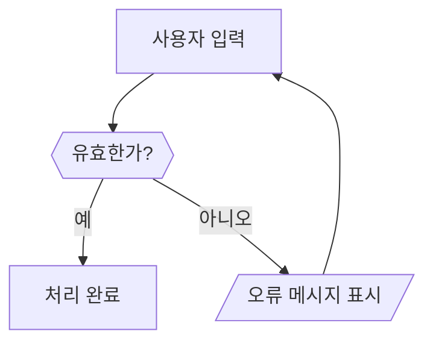
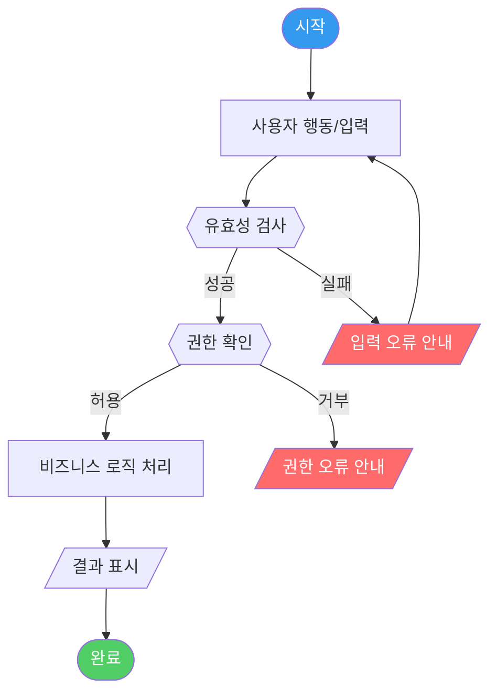
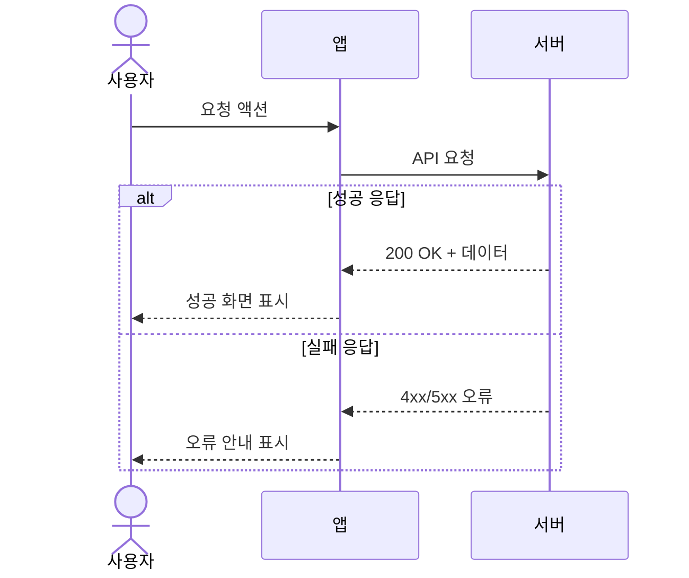

# Diagram Generator — Mermaid.js 생성 및 검증 규약

## 개요

`ux-logic-analyst` 에이전트가 생성한 Mermaid.js 코드의 문법 유효성을 검증하고,
표준화된 형식으로 교정하는 보조 스킬.

**이 스킬은 별도 Python 스크립트 없이 LLM이 직접 문법 규칙을 적용하여 검증한다.**

---

## 1. Mermaid.js 문법 검증 체크리스트

ux-logic-analyst가 코드를 생성한 후 **반드시** 아래 항목을 순서대로 통과해야 한다.

### 필수 구조 확인

- [ ] 첫 줄에 다이어그램 타입 선언 존재
  - `flowchart TD` / `flowchart LR` / `sequenceDiagram` / `stateDiagram-v2` / `journey`
- [ ] 모든 노드 ID: 영문자 또는 숫자만 사용 (공백, 한국어, 특수문자 금지)
  - 올바름: `A`, `UserInput`, `B1`
  - 잘못됨: `사용자입력`, `A B`, `1st-node`
- [ ] 한국어 텍스트: 반드시 노드 레이블(`[]`, `()`, `{}`, `[[]]`) 내부에만 사용
- [ ] 마름모 조건 노드 내 `?` 포함 시: 큰따옴표로 감싸기 `{{"조건인가?"}}`

### 금지 패턴 확인

```
# 파싱 오류를 유발하는 패턴
A --> B & C            ❌  (병렬 연결은 개별 라인으로 분리)
A[제목 (부제목)]        ❌  (노드 내부 일반 괄호 중첩)
B --> C --> D --> B    ❌  (순환 참조 — flowchart에서 금지)
```

### 올바른 패턴 확인



---

## 2. 다이어그램 타입별 사용 가이드

| 타입 | 사용 상황 | 선언 키워드 |
|------|----------|------------|
| Flowchart | 사용자 플로우, 조건 분기, 시스템 처리 흐름 | `flowchart TD` |
| Sequence | 시스템 간 상호작용, API 호출 순서 | `sequenceDiagram` |
| State | 상태 전이 (결제 상태, 주문 상태 등) | `stateDiagram-v2` |
| Journey | 사용자 감정 및 경험 여정 맵 | `journey` |

---

## 3. 표준 PRD Flowchart 템플릿

새 플로우 차트 작성 시 아래 템플릿을 기반으로 시작한다:



---

## 4. 검증 절차 및 실패 처리

### 1차 검증 (자동 교정 시도)

오류 발견 시 아래 규칙으로 자동 교정 후 재검증:

| 오류 유형 | 자동 교정 방법 |
|----------|--------------|
| 노드 ID에 공백 포함 | 공백을 언더스코어(`_`)로 대체 |
| 마름모에 `?` 포함 (따옴표 없음) | `{{"...?"}}` 형식으로 감싸기 |
| 병렬 연결 `&` 사용 | 개별 화살표 라인으로 분리 |
| 닫히지 않은 노드 레이블 | 해당 라인 재작성 |

### 2차 실패 처리

1차 교정 후에도 유효하지 않으면:
- 오류 발생 라인과 원인을 구체적으로 명시
- 오케스트레이터에 오류 내용과 함께 보고:
  > "Mermaid 코드 검증 2회 실패. 해당 플로우는 Open Questions에 추가합니다."

---

## 5. 출력 형식

검증 통과한 코드는 반드시 아래 형식으로 반환:

````markdown
```mermaid
{검증된 Mermaid 코드}
```
````

저장 경로 (선택): `output/diagrams/{기능명}_flow.mmd`

---

## 6. sequenceDiagram 예시 (API 흐름 표현 시)


