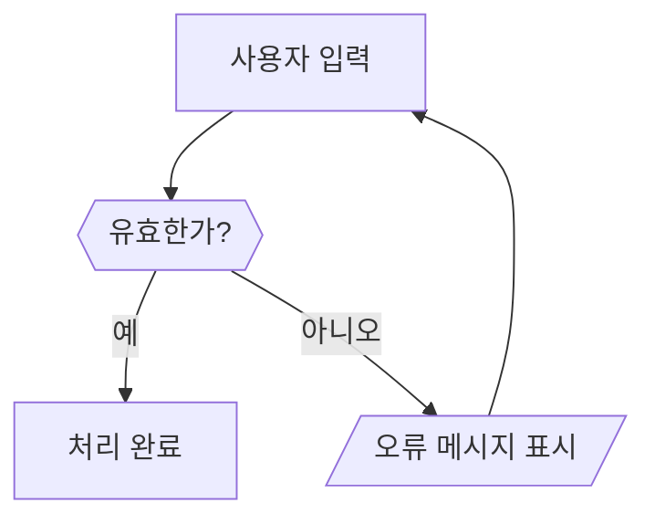
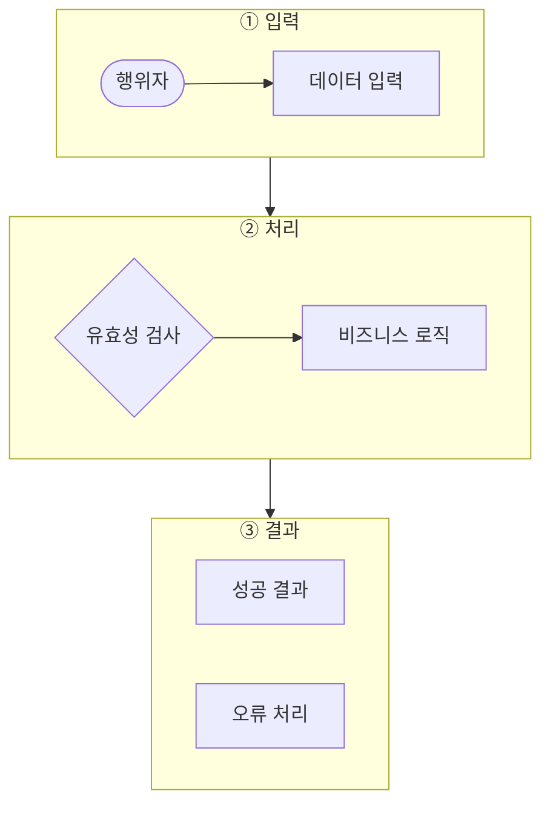
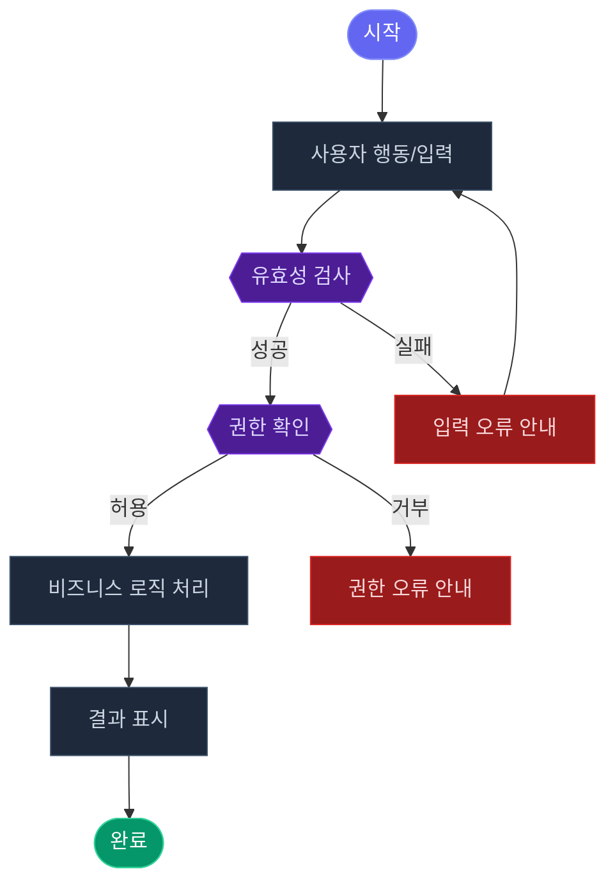
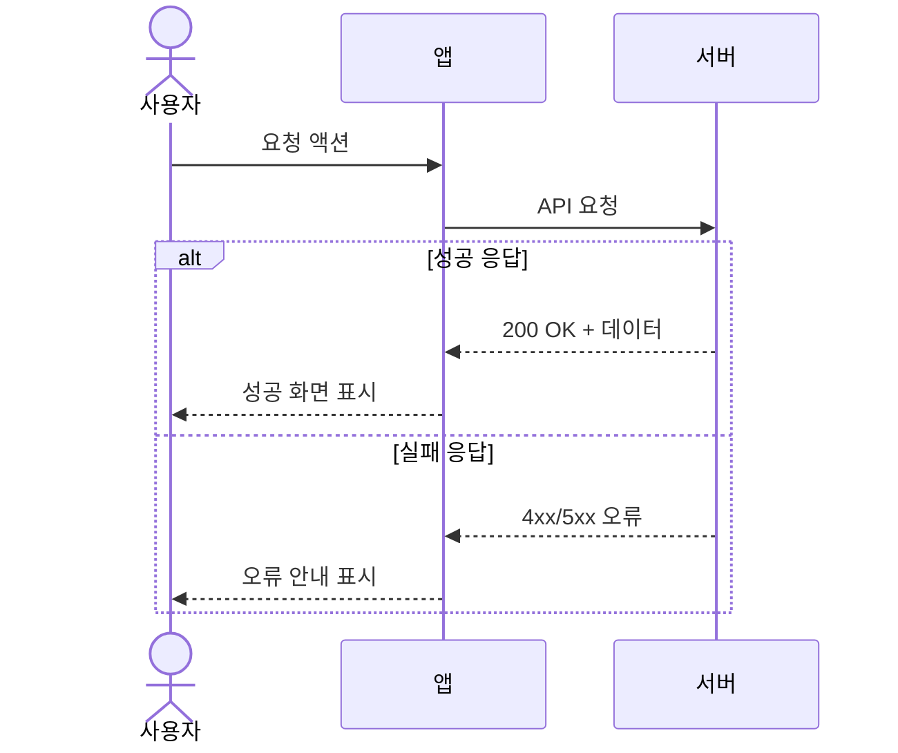

# Diagram Generator — Mermaid.js + SVG/HTML 생성 · 검증 · 렌더링 규약

## 개요

PRD 작성 과정에서 필요한 모든 다이어그램을 생성·렌더링하는 스킬.
- **Mermaid**: 사용자 플로우, 상태 전이, API 시퀀스 → `render.py`로 렌더링
- **SVG/HTML**: 시스템 아키텍처, 비교 매트릭스, 타임라인, IA 등 → `render_html.py`로 렌더링

에이전트로 사용 시: `prd-agent-system/.claude/agents/diagram-generator/AGENT.md` 참조.

**검증**: LLM이 직접 문법 규칙을 적용한다.
**렌더링**: `scripts/render.py` (.mmd → .html) / `scripts/render_html.py` (.svg → .html)

---

## 1. Mermaid.js 문법 검증 체크리스트

ux-logic-analyst가 코드를 생성한 후 **반드시** 아래 항목을 순서대로 통과해야 한다.

### 필수 구조 확인

- [ ] 첫 줄에 다이어그램 타입 선언 존재
  - `flowchart TD` / `flowchart LR` / `sequenceDiagram` / `stateDiagram-v2` / `journey`
- [ ] 모든 노드 ID: 영문자 또는 숫자만 사용 (공백, 한국어, 특수문자 금지)
  - 올바름: `A`, `UserInput`, `B1`
  - 잘못됨: `사용자입력`, `A B`, `1st-node`
- [ ] 한국어 텍스트: 반드시 노드 레이블(`[]`, `()`, `{}`, `[[]]`) 내부에만 사용
- [ ] 마름모 조건 노드 내 `?` 포함 시: 큰따옴표로 감싸기 `{{"조건인가?"}}`

### 금지 패턴 확인

```
# 파싱 오류를 유발하는 패턴
A --> B & C            ❌  (병렬 연결은 개별 라인으로 분리)
A[제목 (부제목)]        ❌  (노드 내부 일반 괄호 중첩)
B --> C --> D --> B    ❌  (순환 참조 — flowchart에서 금지)
```

### 올바른 패턴 확인



---

## 2. 다이어그램 타입별 사용 가이드

| 타입 | 사용 상황 | 선언 키워드 |
|------|----------|------------|
| Flowchart | 사용자 플로우, 조건 분기, 시스템 처리 흐름 | `flowchart TD` |
| Sequence | 시스템 간 상호작용, API 호출 순서 | `sequenceDiagram` |
| State | 상태 전이 (결제 상태, 주문 상태 등) | `stateDiagram-v2` |
| Journey | 사용자 감정 및 경험 여정 맵 | `journey` |

---

## 2-A. 레이아웃 최적화 규칙 (필수)

flowchart를 작성할 때 노드 수와 구조에 따라 아래 규칙을 **반드시** 따른다.
이 규칙을 지키지 않으면 텍스트가 너무 작아지거나 다이어그램이 프레임을 벗어난다.

### 방향 선택 기준

| 조건 | 선택 방향 | 이유 |
|------|---------|------|
| 총 노드 ≤ 7, 분기 적음 | `flowchart LR` | 16:9 가로 프레임에 자연스럽게 맞음 |
| 총 노드 8~14 | `flowchart TD` | 세로 방향이 가로 확장을 줄이고 가독성 유지 |
| 총 노드 15+ 또는 분기 많음 | `flowchart TD` + **서브그래프 분할** | 서브그래프로 논리 레이어를 묶어 폭 압축 |
| 단순 순서 흐름 (분기 없음) | `flowchart LR` | 좌→우 읽기 흐름이 직관적 |

> 현재 캠페인 서비스 플로우(18개 노드)처럼 노드가 많으면 **TD + 서브그래프**가 정답이다.

### 서브그래프 분할 기준

흐름을 3~4개의 논리 레이어로 나눈다:



**서브그래프 명명 규칙**: `["① 레이어명"]` — 번호 + 한국어 레이어명

**언제 서브그래프를 쓰는가:**
- 플로우에 명확한 단계(입력 → 처리 → 결과)가 있을 때
- 동일한 역할의 노드가 3개 이상 병렬 존재할 때
- 외부 시스템과 내부 시스템을 구분할 때

### 노드 레이블 간결화 규칙

| 기준 | 규칙 |
|------|------|
| 레이블 최대 길이 | 한 줄 12자 이내 권장 |
| 줄바꿈 | `\n` 사용, 최대 3줄 |
| 영문 포함 시 | 줄바꿈으로 분리 (`API 호출\nCreative API`) |
| 핵심 키워드만 | 조사·동사 생략 가능 (`데이터 파싱` O, `시트 데이터를 파싱하여 처리` X) |

---

## 3. 표준 색상 팔레트 (다크 테마 기준)

render.py는 `theme: 'dark'`를 기본으로 사용한다.
`.mmd` 파일 내 `style` 명령은 아래 팔레트를 따른다.

### 노드 유형별 색상 기준

| 노드 유형 | fill | color (텍스트) | stroke | 사용 예 |
|---------|------|--------------|--------|-------|
| **시작 / 행위자** | `#6366f1` | `#fff` | `#818cf8` | 마케터, 사용자 |
| **완료 / 성공** | `#059669` | `#fff` | `#34d399` | 발송완료, 저장성공 |
| **오류 / 실패** | `#991b1b` | `#f8d7da` | `#dc2626` | 발송실패, 오류 처리 |
| **경고 / 대기** | `#92400e` | `#fde68a` | `#d97706` | 미등록 소재, 수동입력 대기 |
| **결정 노드 (다이아몬드)** | `#4c1d95` | `#ddd6fe` | `#7c3aed` | 유효성 검사, 분기 조건 |
| **일반 프로세스** | `#1e293b` | `#cbd5e1` | `#3b5068` | 데이터 처리, 변환, 저장 |
| **외부 시스템 / 데이터** | `#1e293b` | `#94a3b8` | `#3b5068` | DB, Google Sheets, API |

### 스타일 선언 예시

```mermaid
style StartNode  fill:#6366f1,color:#fff,stroke:#818cf8
style SuccessNode fill:#059669,color:#fff,stroke:#34d399
style ErrorNode  fill:#991b1b,color:#f8d7da,stroke:#dc2626
style WarnNode   fill:#92400e,color:#fde68a,stroke:#d97706
style DecNode    fill:#4c1d95,color:#ddd6fe,stroke:#7c3aed
style ProcNode   fill:#1e293b,color:#cbd5e1,stroke:#3b5068
```

---

## 5. 표준 PRD Flowchart 템플릿

새 플로우 차트 작성 시 아래 템플릿을 기반으로 시작한다 (표준 색상 팔레트 적용):



---

## 6. 검증 절차 및 실패 처리

### 1차 검증 (자동 교정 시도)

오류 발견 시 아래 규칙으로 자동 교정 후 재검증:

| 오류 유형 | 자동 교정 방법 |
|----------|--------------|
| 노드 ID에 공백 포함 | 공백을 언더스코어(`_`)로 대체 |
| 마름모에 `?` 포함 (따옴표 없음) | `{{"...?"}}` 형식으로 감싸기 |
| 병렬 연결 `&` 사용 | 개별 화살표 라인으로 분리 |
| 닫히지 않은 노드 레이블 | 해당 라인 재작성 |

### 2차 실패 처리

1차 교정 후에도 유효하지 않으면:
- 오류 발생 라인과 원인을 구체적으로 명시
- 오케스트레이터에 오류 내용과 함께 보고:
  > "Mermaid 코드 검증 2회 실패. 해당 플로우는 Open Questions에 추가합니다."

---

## 4-A. SVG/HTML 다이어그램 렌더링

Mermaid로 표현하기 어려운 유형은 `render_html.py`로 렌더링한다.

### 지원 유형

| 유형 | 언제 사용 |
|------|----------|
| 시스템 아키텍처 | 컴포넌트 레이어, 외부 시스템, 자유 배치 |
| 비교 매트릭스 | 기능/옵션 비교, 의사결정 표 |
| 타임라인/로드맵 | 분기·마일스톤·릴리스 계획 |
| IA/사이트맵 | 화면 트리, 네비게이션 계층 |

### SVG → HTML 렌더링

```bash
# SVG 파일 → HTML
cd /Users/musinsa/Documents/agent_project/pm-studio/prd-agent-system && \
python3 .claude/skills/diagram-generator/scripts/render_html.py \
  --svg output/diagrams/{기능명}_{타입}.svg \
  --name {기능명}_{타입} \
  --title "{다이어그램 제목}"

# 인라인 SVG 코드 → HTML
python3 .claude/skills/diagram-generator/scripts/render_html.py \
  --inline-svg "<svg xmlns='...'> ... </svg>" \
  --name {기능명}_{타입}
```

출력 파일: `output/diagrams/{기능명}_{타입}.html`
→ 줌/팬 가능한 다크 테마 HTML로 생성됨.

### SVG 공통 디자인 규칙

- 배경: `#0f172a`, 카드: `#1e293b`, 테두리: `#334155`
- 강조: `#6366f1`, 성공: `#059669`, 오류: `#991b1b`, 경고: `#92400e`
- 텍스트: `#f1f5f9` (주), `#94a3b8` (보조)
- 타입별 SVG 템플릿: `AGENT.md` §4 참조

---

## 7. 출력 형식 및 렌더링 파이프라인

### Step 1 — Mermaid 코드 반환

검증 통과한 코드는 반드시 아래 형식으로 반환:

````markdown
```mermaid
{검증된 Mermaid 코드}
```
````

### Step 2 — .mmd 파일 저장

저장 경로: `output/diagrams/{기능명}_flow.mmd`

> `ux-logic-analyst`가 여러 플로우를 생성하는 경우, 각 플로우별로 별도 `.mmd` 파일로 저장한다.
> 파일명 규칙: `{주제}_{타입}_flow.mmd` (예: `campaign_user_flow.mmd`, `campaign_state_flow.mmd`)

### Step 3 — HTML 렌더링 (필수)

`.mmd` 저장 직후 `render.py`를 실행하여 브라우저에서 바로 열 수 있는 HTML을 생성한다.

```bash
# 단일 파일
cd /Users/musinsa/Documents/agent_project/pm-studio/prd-agent-system && \
python3 .claude/skills/diagram-generator/scripts/render.py \
  output/diagrams/{기능명}_flow.mmd

# 전체 .mmd 일괄 렌더링
cd /Users/musinsa/Documents/agent_project/pm-studio/prd-agent-system && \
python3 .claude/skills/diagram-generator/scripts/render.py --all
```

출력 파일: `output/diagrams/{기능명}_flow.html`
→ `file://` 경로로 macOS Safari / Chrome 에서 바로 확인 가능.

### 인라인 코드로 즉시 렌더링 (에이전트 직접 호출 시)

```bash
python3 .claude/skills/diagram-generator/scripts/render.py \
  --inline "flowchart TD\n  A --> B" \
  --name campaign_inline_flow
```

---

### Step 4 — PNG 내보내기 (선택)

다이어그램만 PNG로 추출할 때 사용한다. **프레임·툴바·헤더 없이 SVG 내용만** 저장된다.
Playwright headless Chromium을 사용하며, 레티나(2x) 해상도가 기본값이다.

```bash
# HTML → PNG (단일)
cd /Users/musinsa/Documents/agent_project/pm-studio/prd-agent-system && \
python3 .claude/skills/diagram-generator/scripts/export_png.py \
  output/diagrams/{기능명}_flow.html

# .mmd 지정 시 HTML 자동 렌더링 후 PNG 추출
python3 .claude/skills/diagram-generator/scripts/export_png.py \
  output/diagrams/{기능명}_flow.mmd

# 전체 일괄 PNG 내보내기
python3 .claude/skills/diagram-generator/scripts/export_png.py --all

# 옵션: 배경색 / 여백 / 해상도 지정
python3 .claude/skills/diagram-generator/scripts/export_png.py \
  output/diagrams/{기능명}_flow.html \
  --bg "#0f172a" --padding 48 --scale 2
```

**render.py `--png` 플래그**: HTML 렌더링과 PNG 내보내기를 한 번에 실행

```bash
# 렌더링 + PNG 동시 실행
python3 .claude/skills/diagram-generator/scripts/render.py \
  output/diagrams/{기능명}_flow.mmd --png

# 전체 일괄 렌더링 + PNG
python3 .claude/skills/diagram-generator/scripts/render.py --all --png
```

**PNG 옵션 기본값:**

| 옵션 | 기본값 | 설명 |
|------|--------|------|
| `--bg` | `#1e293b` | 배경색 (다이어그램 카드색과 동일) |
| `--padding` | `40` | SVG 주변 여백(px) |
| `--scale` | `2` | 레티나 해상도 배율 (1=72dpi, 2=144dpi) |

출력 파일: `output/diagrams/{기능명}_flow.png`

> **Pillow 설치 시** 배경색이 정확히 합성됨. 없으면 투명 배경 PNG로 저장.
> `pip install Pillow` 권장.

---

## 8. sequenceDiagram 예시 (API 흐름 표현 시)


