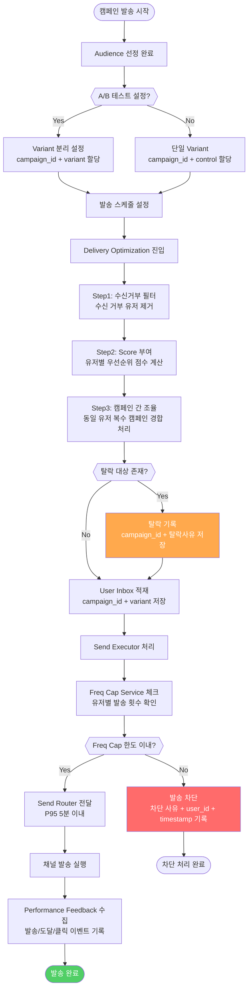
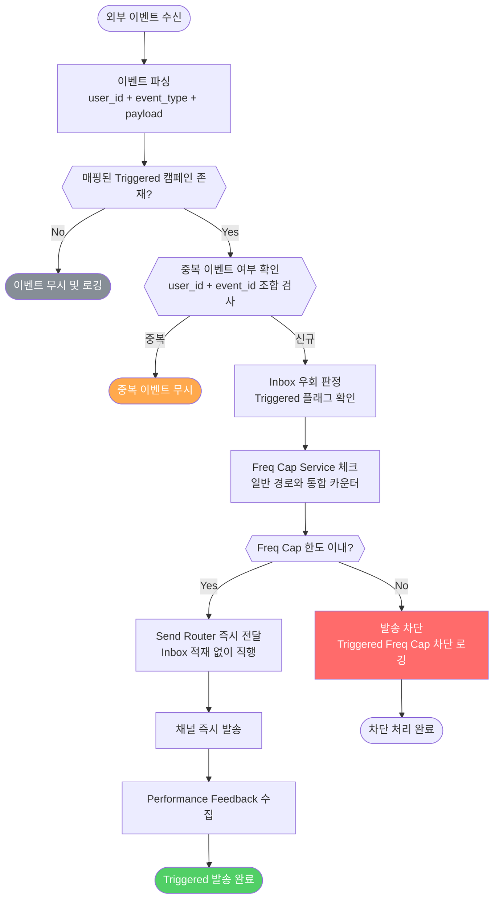
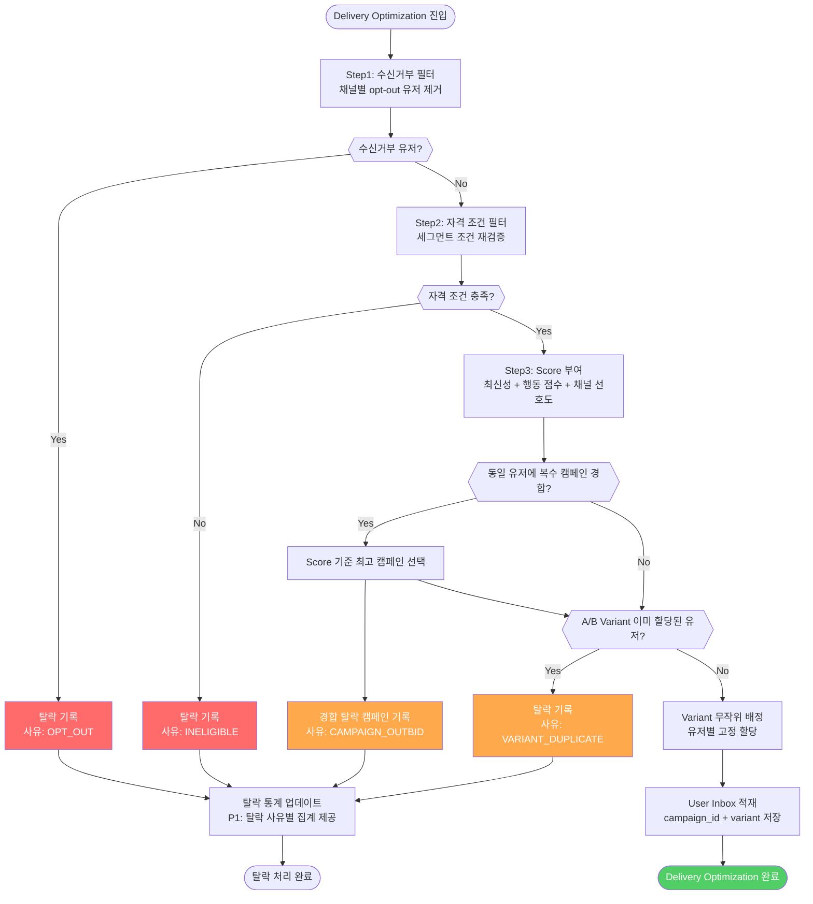

# [202602] MATCH Inbox Optimizer PRD

> **상태:** Draft
> **작성일:** 2026-02-27
> **작성자:** PRD Builder Agent (Strategic PRD Builder v1.0)
> **검토자:** 미정 (PM 지정 필요)
> **버전:** v1.0
> **참조 문서:**
> - MATCH Campaign Meta-Engine - High-Level Design (PE Space, 2026-02-10)
> - [2026.02.04] MATCH Roadmap Review w/ MKT (PE Space, 2026-02-04)
> - 무신사 앱푸시 캠페인 정책 검토 (PE Space, 2025-12-10)
> - Fatigue Management & Frequency Capping System (PE Space, 2026-01-19)

---

## 1. 개요 (Overview)

### 배경 및 문제 정의

현재 MATCH 시스템의 앱푸시 발송 파이프라인은 "Audience를 뽑으면 전원에게 발송한다"는 단순한 2단계 구조다. Audience(발송 대상) 선정 이후 중간 판단 레이어가 없어 다음 세 가지 핵심 문제가 동시에 발생하고 있다.

1. **다중 캠페인 중복 발송**: 772개 Activation이 각자 독립 실행되어 동일 유저에게 같은 시간대 다수의 푸시가 발송되며, 이를 조율할 방법이 없다.
2. **성과 측정 불가**: `campaign_id` 체계 부재로 어떤 캠페인이 실제 구매에 기여했는지 추적이 불가능하다. A/B 테스트를 설계하거나 ML 피처로 활용할 수 없다.
3. **유저 경험 침해**: 피로도 관리 없는 다중 발송으로 푸시 수신 거부율이 증가하여 장기적으로 발송 가능 모수가 감소하는 악순환이 이어지고 있다.

**해결하려는 핵심 질문:**
> "어떻게 하면 유저에게 가장 적절한 1개의 메시지를 가장 적절한 시점에 보내어, 수신 경험을 해치지 않으면서 CRM 기여 구매를 극대화할 수 있는가?"

### 목표 (Goals)

| 목표 | 측정 지표 | 목표 기간 |
|------|----------|----------|
| 캠페인 간 조율로 동일 유저 중복 수신 감소 | 유저별 일평균 수신 메시지 수 감소 (기준치 미정) | 론칭 후 4주 |
| 발송→구매 전환 측정 체계 확립 | campaign_id + variant 기준 발송/도달/클릭 수집률 100% | 론칭 시점 |
| 푸시 수신 거부율 악화 방지 | 전주 대비 거부율 증가폭 +2%p 이내 유지 | 론칭 후 지속 |

### 비목표 (Non-Goals)

이번 버전에서 **포함하지 않는** 범위:
- **ML 기반 최적화 알고리즘**: Uplift 모델, LP Solver 등 ML 기반 score 산출은 후속 Phase에서 정의
- **Inbox 저장소 구현체 선정**: PG / Redis+PG / CH+Redis 중 선택은 HLD 이후 LLD에서 결정
- **Action Based CRM(ABC) 내재화**: Triggered 캠페인 진입 경로의 Inbox 우회만 정의, ABC 엔진 자체는 Out of Scope
- **Performance Feedback 고도화**: 채널별 비교, 장기 코호트 분석, ML 학습 루프 연동은 후속 Phase
- **마이그레이션 계획**: As-Is(cohort_users 직접 참조) → To-Be(Inbox 경유) 전환 절차는 별도 문서

---

## 2. 성공 지표 (Metrics)

### North Star Metric

- **지표명:** 앱푸시 CRM 유도 구매 전환율 (Push→Purchase Rate)
- **정의:** 앱푸시 수신 후 24시간 이내 구매 완료 건수 / 전체 앱푸시 도달 건수
- **현재 기준치(Baseline):** 측정 인프라 부재로 현재 미집계 → 본 PRD 구현 후 최초 측정
- **목표값:** 기준치 측정 후 4주 이내 10% 개선 (OKR 확정은 Open Questions 참조)
- **비즈니스 연결:** Inbox Optimizer의 핵심 가치는 불필요한 발송을 줄이고 적절한 메시지만 보내어 실제 구매로 이어지는 비율을 높이는 것. 이 지표가 개선되면 발송 비용 효율성과 매출 기여가 동시에 향상된다.

### Primary Metrics

| 지표명 | 현재 기준치 | 목표값 | 측정 주기 | North Star 연결 |
|--------|-----------|--------|----------|----------------|
| 유저별 일평균 수신 메시지 수 | 미집계 | 기준치 대비 30% 감소 | 주간 | 중복 발송 감소 → 피로도 감소 → 수신 품질 향상 → 전환율 개선 |
| campaign_id 기준 CTR | 미집계 | 기준치 대비 20% 개선 | 캠페인 단위 | 높은 CTR = 메시지 적합성 높음 → 구매로 이어질 가능성 증가 |
| Delivery Optimization 탈락률 | N/A (신규) | 캠페인 간 조율로 인한 탈락 비율 모니터링 | 주간 | 과도한 탈락은 비즈니스 기회 손실. 적정 탈락률 관리 필요 |

### Guardrail Metrics

| 지표명 | 허용 한계선 | 초과 시 대응 | 모니터링 주기 |
|--------|-----------|------------|------------|
| 푸시 수신 거부율 | 전주 대비 +2%p 이내 | 운영자 알림 발송, 수동 판단 및 조치 | 일별 |
| 발송 지연 (P95) | 5분 이내 | 운영자 알림 즉시 발송 | 실시간 |

---

## 3. 기능 요구사항 (Functional Requirements)

> **작성 원칙:** 무엇을(What) 중심으로 기술. 어떻게(How) 구현할지는 포함하지 않는다.

### P0 — 필수 기능 (14건)

#### [User Inbox]

| ID | 요구사항 | 수용 기준 |
|----|---------|---------|
| P0-001 | 시스템이 캠페인 발송을 시작할 때, 시스템은 캠페인 메시지를 Send Executor로 직접 라우팅하지 않고 유저별 User Inbox에 먼저 적재한다. | 수동 스케줄 및 AI-Optimized 캠페인의 모든 발송 후보 메시지가 User Inbox를 경유한다. Inbox를 우회하여 Send Executor에 직접 도달한 메시지가 0건임을 확인할 수 있다. |
| P0-002 | 시스템이 유저별 Inbox에 메시지를 적재할 때, 시스템은 각 메시지에 고유한 campaign_id와 variant 식별자를 부여한다. | Inbox에 적재된 모든 메시지에 campaign_id 필드와 variant 필드가 존재한다. campaign_id 또는 variant가 누락된 메시지는 적재 단계에서 거부(reject)된다. |

#### [Delivery Optimization]

| ID | 요구사항 | 수용 기준 |
|----|---------|---------|
| P0-003 | 시스템이 Audience에서 발송 대상 유저 목록을 확정할 때, 시스템은 Delivery Optimization 단계(필터링 → score 부여 → 캠페인 간 조율)를 거친 후 User Inbox에 메시지를 적재한다. | Delivery Optimization을 우회하여 Inbox에 직접 적재되는 경로가 존재하지 않는다. 각 메시지에 Optimization이 부여한 score 값이 포함된다. |
| P0-004 | 시스템이 동일 유저에 대해 복수의 캠페인 메시지를 처리할 때, 시스템은 캠페인 간 조율(Coordination)을 수행하여 score 기준으로 우선순위가 낮은 메시지를 탈락(drop) 처리한다. | 동일 유저의 Inbox에 복수 캠페인 메시지가 경합할 때 score 기준으로 조율된 결과만 최종 Inbox에 남는다. 탈락 메시지의 campaign_id와 탈락 사유가 기록된다. |
| P0-005 | 마케터가 캠페인에 A/B 테스트 variant를 설정하면, 시스템은 Delivery Optimization 단계에서 유저를 variant별로 배정하고 동일 유저가 복수의 variant를 수신하지 않도록 보장한다. | 하나의 캠페인에 2개 이상의 variant를 설정할 수 있다. 동일 유저에게 동일 campaign_id의 variant가 중복 배정되지 않는다. variant별 발송 비율(%)을 설정할 수 있으며 합계가 100%를 초과하면 저장이 거부된다. |

#### [Freq Cap Service]

| ID | 요구사항 | 수용 기준 |
|----|---------|---------|
| P0-006 | Send Executor가 Inbox에서 메시지를 꺼내 발송하려 할 때, 시스템은 Freq Cap Service를 통해 해당 유저의 설정 기간 내 발송 횟수를 확인하고 한도 초과 시 발송을 차단한다. | Freq Cap 한도를 초과한 유저에게는 메시지가 발송되지 않는다. 차단된 메시지의 user_id, campaign_id, 차단 시각, 차단 사유가 기록된다. |
| P0-007 | 마케터가 Freq Cap 설정을 관리할 때, 시스템은 발송 채널 수준의 일별/주별 Freq Cap을 독립적으로 설정할 수 있도록 한다. | 채널(앱푸시) 수준의 일별/주별 Freq Cap을 설정할 수 있다. Freq Cap 설정값 변경 시 변경 이력(변경자, 변경 시각, 이전 값, 신규 값)이 기록된다. Freq Cap 설정이 없는 상태에서 메시지 발송이 무제한으로 이루어지지 않도록 기본값(default cap)이 적용된다. |

#### [Send Executor]

| ID | 요구사항 | 수용 기준 |
|----|---------|---------|
| P0-008 | Send Executor가 Inbox에서 메시지를 꺼낼 때, 시스템은 Freq Cap 체크를 완료한 메시지만 Send Router로 전달한다. | Freq Cap 체크 결과 "통과"인 메시지만 Send Router에 전달된다. Inbox에서 메시지를 꺼낸 시점부터 Send Router 전달까지 P95 기준 5분 이내에 완료된다. |

#### [긴급 발송 / Triggered 경로]

| ID | 요구사항 | 수용 기준 |
|----|---------|---------|
| P0-009 | 시스템이 Triggered(액션 기반) 캠페인 이벤트를 수신할 때, 시스템은 User Inbox를 우회하여 해당 메시지를 Freq Cap 체크 후 Send Executor로 직접 전달한다. | Triggered 캠페인으로 분류된 메시지는 Delivery Optimization 및 User Inbox 단계를 거치지 않고 Send Executor에 도달한다. 긴급 발송 경로도 Freq Cap 체크는 반드시 거친다. |
| P0-010 | 시스템이 Triggered 캠페인을 처리할 때, 시스템은 일반 Inbox 경로의 처리 지연과 무관하게 긴급 발송 경로의 메시지 전달을 보장한다. | 일반 Inbox 경로 지연 발생 시에도 긴급 발송 경로의 메시지 전달이 차단되지 않는다. 동일 유저에 대해 긴급 발송과 Inbox 발송이 동시에 발생할 때 Freq Cap은 통합 적용된다. |

#### [Performance Feedback]

| ID | 요구사항 | 수용 기준 |
|----|---------|---------|
| P0-011 | 시스템이 메시지를 발송한 후, 시스템은 campaign_id와 variant 기준으로 발송(sent), 도달(delivered), 클릭(clicked) 이벤트를 수집하고 집계한다. | 각 이벤트에 campaign_id, variant, 이벤트 발생 시각이 포함된다. 발송 후 24시간 이내의 클릭 이벤트는 Push→Purchase Rate 계산의 기준 윈도우로 구분하여 기록된다. |
| P0-012 | 마케터가 캠페인 성과를 조회할 때, 시스템은 campaign_id와 variant별 발송 수, 도달 수, 클릭 수를 제공한다. | campaign_id 단위로 발송/도달/클릭 수치를 조회할 수 있다. A/B 테스트 적용 캠페인은 variant별 수치를 분리하여 조회할 수 있다. |

#### [Guardrail 모니터링]

| ID | 요구사항 | 수용 기준 |
|----|---------|---------|
| P0-013 | 시스템이 발송 처리를 수행하는 동안, 시스템은 Inbox에서 메시지를 꺼낸 시점부터 Send Router 전달까지의 지연 시간을 실시간으로 측정하고 P95가 5분을 초과할 때 운영자 알림을 발생시킨다. | P95 지연이 5분을 초과하면 운영 알림이 발생한다. 알림에 해당 시간대, 영향 건수, P95 수치가 포함된다. |
| P0-014 | 시스템이 앱푸시를 운영하는 동안, 시스템은 푸시 수신 거부율이 전주 대비 +2%p를 초과할 때 운영 알림을 발생시킨다. | 전주 대비 거부율 증감을 계산할 수 있는 데이터가 기록된다. 임계값 초과 시 운영 알림에 현재 거부율과 전주 거부율이 포함된다. 알림 이후 발송은 자동 중단되지 않으며 운영자 판단에 위임한다. |

### P1 — 향상 기능 (6건)

| ID | 요구사항 | 수용 기준 |
|----|---------|---------|
| P1-001 | 마케터가 캠페인을 생성하거나 수정할 때, 시스템은 동일 대상 유저에게 유사한 시간대에 발송되는 기존 캠페인 목록을 미리 보여준다. | 새 캠페인의 발송 예정 시각 기준 ±1시간 내에 Audience가 겹치는 캠페인 목록이 표시된다. 마케터는 목록을 무시하고 저장을 진행할 수 있다(강제 차단 아님). |
| P1-002 | 마케터가 Freq Cap 설정을 변경할 때, 시스템은 현재 진행 중인 캠페인 중 해당 변경에 영향을 받는 캠페인 목록과 예상 영향 유저 수를 표시한다. | 변경 전/후 Freq Cap 값과 영향 캠페인 목록이 함께 표시된다. |
| P1-003 | 마케터가 A/B 테스트 캠페인의 성과를 조회할 때, 시스템은 variant별 CTR과 통계적 유의성 지표를 함께 제공한다. | variant별 CTR과 신뢰 구간(confidence interval) 또는 p-value 중 하나 이상이 표시된다. 샘플이 충분하지 않으면 "데이터 수집 중" 상태가 표시된다. |
| P1-004 | 마케터가 캠페인 발송 결과를 조회할 때, 시스템은 발송 대상 중 Freq Cap으로 차단된 유저 수와 비율을 함께 제공한다. | campaign_id 단위로 Freq Cap 차단 건수와 차단율(차단 수 / 원래 Audience 수)이 조회된다. |
| P1-005 | 시스템이 메시지를 탈락(drop) 처리할 때, 시스템은 탈락 사유를 유형별로 분류하여 마케터가 조회할 수 있도록 제공한다. | 탈락 사유 유형별(OPT_OUT / INELIGIBLE / CAMPAIGN_OUTBID / VARIANT_DUPLICATE) 건수를 campaign_id 단위로 조회할 수 있다. |
| P1-006 | 마케터가 캠페인 성과 리포트를 조회할 때, 시스템은 발송 시각 기준 24시간 윈도우 내 Push→Purchase 전환 수를 campaign_id 및 variant별로 제공한다. | campaign_id 단위로 24시간 윈도우 내 전환 수와 전환율이 조회된다. 전환 기여 기준(last-touch, 24h window)이 리포트 내에 명시된다. |

### Out of Scope

- **ML 기반 score 산출**: Phase 1의 Delivery Optimization은 규칙 기반 필터링과 수동 우선순위 입력에 한정. Uplift 모델, LP Solver는 후속 Phase.
- **Inbox 저장소 구현체 선정**: PG / Redis+PG / CH+Redis 선택은 LLD에서 결정.
- **Action Based CRM(ABC) 내재화**: Triggered 캠페인 진입 경로 정의만 포함. ABC 엔진 기능 정의는 Out of Scope.
- **마이그레이션 계획**: 기존 구조 → Inbox 구조 전환 절차는 별도 문서.
- **Performance Feedback 고도화**: 대시보드, ML 학습 루프, 상세 퍼널 분석은 후속 Phase.

---

## 4. 사용자 플로우 (User Flow)

### 4-1. 수동 스케줄 캠페인 발송 — 정상 플로우

### 4-2. Triggered(긴급) 캠페인 발송 — 정상 플로우

### 4-3. Delivery Optimization 내부 처리 — 탈락 플로우

---

## 5. 시스템 정책 (System Policies)

| 정책 ID | 조건 | 시스템 동작 |
|---------|------|------------|
| POL-001 | Delivery Optimization 단계에서 동일 user_id가 동일 campaign_id의 variant를 이미 할당받은 경우 | 신규 variant 배정을 차단하고 기존 할당 variant를 유지. 탈락 사유 `VARIANT_DUPLICATE`로 기록 |
| POL-002 | user_id 기준 24시간 롤링 윈도우 내 발송 건수가 일일 한도 도달 | Send Executor에서 해당 메시지 차단. 차단 사유 `DAILY_FREQ_CAP_EXCEEDED`, timestamp 로깅. 발송 카운터 증가 없음 |
| POL-003 | user_id 기준 7일 롤링 윈도우 내 발송 건수가 주간 한도 도달 | Send Executor에서 해당 메시지 차단. 차단 사유 `WEEKLY_FREQ_CAP_EXCEEDED`, timestamp 로깅 |
| POL-004 | 캠페인 타입이 `TRIGGERED`로 분류된 경우 | Delivery Optimization 및 User Inbox 적재 단계 건너뜀. Freq Cap 체크 이후 Send Router로 직행. Freq Cap 체크는 생략 불가 |
| POL-005 | Send Executor 처리 기준 P95 발송 지연이 5분 초과 | 실시간 모니터링에서 운영자 알림 즉시 발송. 알림에 해당 시간대, 지연 건수, P95 수치 포함 |
| POL-006 | 전주 동일 요일 대비 푸시 수신 거부율이 +2%p 초과 | 운영자에게 캠페인 ID 및 채널 기준 거부율 알림 발송. 자동 발송 중단 없음(알림 only). 알림 후 24시간 이내 조치 미이행 시 재알림 |
| POL-007 | Delivery Optimization 단계에서 동일 user_id에 복수의 캠페인이 경합할 경우 | Score가 가장 높은 캠페인 1개를 선택하여 Inbox 적재. 탈락 캠페인은 사유 `CAMPAIGN_OUTBID`와 함께 기록 |
| POL-008 | User Inbox 적재 시 `campaign_id` 또는 `variant` 필드 중 하나라도 누락된 경우 | 적재 요청 거부. 오류 코드 `INBOX_REQUIRED_FIELD_MISSING` 반환. 해당 메시지 탈락 처리 및 운영자 알림 |
| POL-009 | 운영자가 Freq Cap 정책(일일/주간/채널별 한도)을 변경하는 경우 | 변경 즉시 현재 진행 중인 Freq Cap 적용 대상 캠페인 목록을 운영자에게 표시. 변경 전후 예상 차단 비율 변동치 제공(P1) |
| POL-010 | Delivery Optimization 수신거부 필터 단계 | 수신거부 필터를 Score 부여 이전에 가장 먼저 실행. 채널별 opt-out 상태를 발송 요청 시점 기준으로 조회 |

---

## 6. 예외 케이스 (Edge Cases)

| 예외 ID | 발생 조건 | 예상 영향 | 처리 방안 |
|---------|----------|----------|---------|
| EX-001 | campaign_id 또는 variant 값이 null/empty 상태로 Inbox 적재 요청 | 추적 불가 상태로 발송 시 Performance Feedback 수집 불가. A/B 결과 오염 가능성 | 적재 단계에서 유효성 검사 실패 처리. 오류 코드 `INBOX_REQUIRED_FIELD_MISSING` 반환 및 운영 알림 |
| EX-002 | 동일 campaign_id에 대해 동일 user_id의 variant 재배정 시도 | 동일 유저가 복수 variant 수신 → A/B 통계 오염, 유의성 지표 왜곡 | Variant 배정 이력 조회 후 이미 할당된 경우 기존 variant 유지. 탈락 사유 `VARIANT_DUPLICATE` 로깅 |
| EX-003 | 동일 user_id + event_type + campaign_id 조합의 Triggered 이벤트가 단시간 내 복수 발생 | 동일 내용의 Triggered 메시지가 중복 발송되어 사용자 경험 훼손 및 Freq Cap 과소비 | idempotency key 기반 중복 처리 방지. 설정 가능한 dedup 윈도우 내 동일 조합 재발생 시 무시 |
| EX-004 | Freq Cap Service가 타임아웃(3초 초과) 또는 503 응답을 반환 | Send Executor 파이프라인 전체 블로킹. 발송 지연 P95 SLA(5분) 위반 가능성 | Fail-Open 또는 Fail-Closed 정책 선택 필요(OQ-001 참조). Circuit Breaker 패턴 적용. 장애 발생 즉시 운영 알림 |
| EX-005 | 트래픽 급증 또는 Send Router 처리 지연으로 P95 발송 지연이 5분 초과 | 시간 민감 캠페인(프로모션 마감 등)의 비즈니스 가치 훼손 | 실시간 P95 모니터링. 임계치 초과 시 즉시 운영자 알림(POL-005) |
| EX-006 | 특정 캠페인 발송 후 푸시 수신 거부율이 전주 대비 +2%p 초과 상승 | 장기적 발송 가능 대상 모수 감소. 캠페인 메시지 품질 또는 타겟팅 정책 문제 가능성 | 거부율 임계치 초과 시 운영자 알림(POL-006). 자동 중단 없이 운영자 판단에 위임 |
| EX-007 | Delivery Optimization 캠페인 간 조율 단계에서 복수 캠페인의 Score가 동일한 경우(동점) | 결정론적 우선순위 선택 불가. 실행마다 다른 캠페인 선택 시 A/B 균형 왜곡 가능 | 동점 시 결정론적 타이브레이킹 규칙 적용 필요(OQ-003 참조) |
| EX-008 | Delivery Optimization 진입 이후 Inbox 적재 완료 전까지 유저가 푸시 수신 거부를 완료 | 수신 거부 의사를 밝힌 유저에게 메시지가 발송되는 개인정보 보호 및 규정 위반 리스크 | Send Executor 발송 직전 opt-out 상태 재조회(이중 체크) 추가. Inbox 적재 이후라도 발송 직전 최종 확인 필수 |

---

## 7. 실행 계획 (Execution Plan)

> **전제:** 본 PRD는 MATCH Roadmap의 Phase 3 "유저별 최적 발송"에 해당하며, Phase 1(campaign_id 체계 구축) 및 Phase 2(Delivery Optimization 기초 레이어) 완료 이후에 착수 가능하다.

### 마일스톤

| 단계 | 내용 | 예상 완료 |
|------|------|---------|
| LLD 설계 | Inbox 저장소 구현체 선정, Freq Cap 서비스 아키텍처 확정, API 인터페이스 정의 | TBD |
| Dev Sprint 1 | User Inbox 적재 및 campaign_id + variant 식별 체계 구현 | TBD |
| Dev Sprint 2 | Delivery Optimization (필터링, score 부여, 캠페인 간 조율) 구현 | TBD |
| Dev Sprint 3 | Freq Cap Service, Send Executor, Triggered 경로 구현 | TBD |
| Dev Sprint 4 | Performance Feedback (발송/도달/클릭 수집), 운영 알림(P95, 거부율) 구현 | TBD |
| QA | 기능 테스트, 피로도 시뮬레이션, 성능 테스트 (P95 발송 지연 검증) | TBD |
| Soft Launch | 내부 캠페인 일부 Inbox 경유 전환, 지표 모니터링 | TBD |
| Full Launch | 전체 수동 스케줄 캠페인 Inbox 경유 전환 | TBD (올해 목표) |

### 의존성

| 항목 | 내용 | 영향도 |
|------|------|--------|
| Phase 1 완료 | campaign_id 체계 및 CMS Integration Layer 구축 완료 필요 | 높음 |
| LLD 완료 | Inbox 저장소 구현체 선정 및 Freq Cap 서비스 아키텍처 확정 필요 | 높음 |
| 마케팅팀 협의 | Freq Cap 기본값, 캠페인 우선순위 정책, Push→Purchase 전환 기여 방식 확정 | 중간 |
| 데이터 엔지니어링 | Performance Feedback 이벤트 수집 파이프라인 확보 | 중간 |

---

## 8. Open Questions

PRD 승인 전 PM이 결정해야 할 미해결 항목:

| # | 질문 | 담당자 | 마감일 | 상태 |
|---|------|--------|--------|------|
| OQ-001 | **Freq Cap 서비스 장애 시 정책:** 장애 시 Fail-Open(발송 허용, Freq Cap 한도 초과 가능)으로 할 것인가, Fail-Closed(발송 전면 차단)로 할 것인가? | 미정 | TBD | 미결 |
| OQ-002 | **Triggered 캠페인 Freq Cap 카운터 공유 여부:** Triggered 발송이 일반 캠페인 Freq Cap 카운터를 공유하는가? 트랜잭션성 메시지(결제 완료, 배송 출발 등)는 Freq Cap 적용 대상에서 제외할 것인가? | 미정 | TBD | 미결 |
| OQ-003 | **캠페인 Score 동점 타이브레이킹 규칙:** campaign_id 사전 순 / 생성 시각 오래된 것 우선 / 비즈니스 가중치 기반 / 랜덤 중 하나로 정책 명문화 필요 | 미정 | TBD | 미결 |
| OQ-004 | **Freq Cap 기본값(default cap):** 마케터가 별도 설정을 하지 않았을 때 적용되는 기본 일별/주별 한도 수치를 비즈니스 측 합의 필요 (예: 일 3회 / 주 10회 등) | 미정 | TBD | 미결 |
| OQ-005 | **Delivery Optimization Score 부여 기준:** Phase 1에서 score를 마케터가 수동으로 입력하는 캠페인 우선순위 수치로 할 것인가, 시스템이 규칙 기반으로 자동 산출할 것인가? | 미정 | TBD | 미결 |
| OQ-006 | **Push→Purchase 전환 기여 방식:** 동일 유저가 24시간 윈도우 내 복수의 캠페인 메시지를 수신한 경우 전환을 어느 campaign_id에 귀속할 것인가? (last-touch / first-touch / 분배) | 미정 | TBD | 미결 |
| OQ-007 | **A/B 테스트 통계적 유의성 판정 기준:** 신뢰 구간 95% vs 99%, 최소 샘플 사이즈 기준, 조기 종료(early stopping) 허용 여부 | 미정 | TBD | 미결 |
| OQ-008 | **Freq Cap 차단 비율 운영 알림 임계치:** 전체 발송 대비 차단 비율이 몇 %를 초과할 때 운영자 알림을 트리거할 것인가? | 미정 | TBD | 미결 |

---

## Self-Review 체크리스트 (완료)

| 검토 항목 | 결과 |
|----------|------|
| 구현 방법(How) 미포함 | ✅ API, DB, 서버, 배치 등 기술 용어 불포함 확인 |
| 목표-지표 정합성 | ✅ North Star(Push→Purchase Rate) → P0-011(발송/클릭 수집) → P1-006(전환율 조회) 논리적 연결 확인 |
| 필수 섹션 완비 | ✅ 개요/지표/요구사항/플로우/정책/예외케이스/실행계획/Open Questions 모두 포함 |
| Mermaid 문법 유효성 | ✅ 노드 ID 영문+숫자, 한국어 레이블 내부만 사용, `?` 포함 조건 노드 따옴표 처리 |
| Open Questions 정리 | ✅ 8건 담당자 지정 요청 및 섹션 8에 기록 |

---

*이 문서는 PRD Builder Agent (Strategic PRD Builder v1.0)에 의해 자동 생성되었습니다. (2026-02-27)*
*참조 Confluence 문서: MATCH Campaign Meta-Engine HLD, MATCH Roadmap Review w/ MKT, 앱푸시 캠페인 정책 검토, Fatigue Management & Frequency Capping System*
