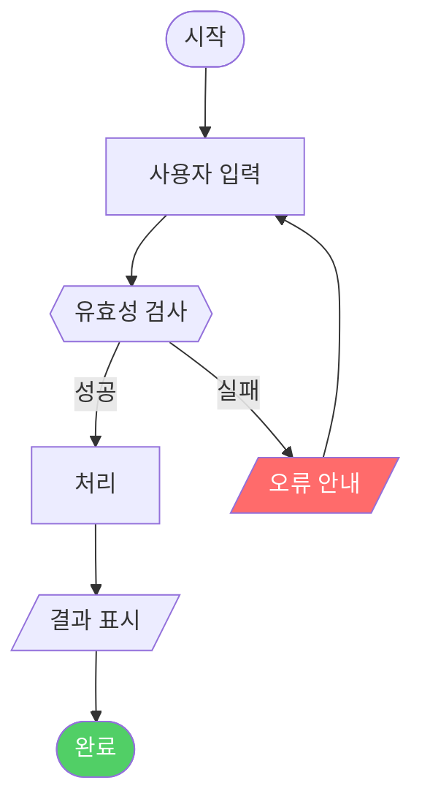

# 표준 PRD 템플릿 (Confluence 양식 기준)

## 사용 방법

이 템플릿은 PRD Builder Agent가 최종 PRD를 작성할 때 구조 기준으로 사용한다.
`{중괄호}` 부분을 실제 내용으로 채우고, 해당 없는 섹션은 "해당 없음"으로 표기한다.

> 원본 양식: https://wiki.team.musinsa.com/wiki/spaces/~7120209bbd1f66a6e34385957b56995ea34f89/pages/314545591/PRD+Template

---

# [{YYYYMM}] {기능명} PRD

| **Version** | **날짜** | **상세** |
|-------------|---------|---------|
| 1.0 | {YYYY-MM-DD} | 최초 작성 |

| **2-Pager** | {2-Pager URL 또는 미정} |
|-------------|------------------------|
| **Initiatives** | {Jira Initiative 키 또는 미정} |

| **구성원** | PM | {PM 이름} |
|-----------|-----|----------|
| | Design | {디자이너 이름} |
| | Dev | FE: {이름} / BE: {이름} / MLE: {이름} |
| | QA | {QA 담당자} |
| | 마케팅 | {마케팅 담당자} |
| **Milestone** | 개발: {날짜} / QA: {날짜} / 정상 운영: {날짜} |

---

# 1. 배경 및 문제

{현재 사용자가 겪고 있는 문제 또는 놓치고 있는 기회를 2~3문장으로 서술.
데이터나 사용자 인터뷰 근거가 있으면 함께 포함.}

**해결하려는 핵심 질문:**
> {이 기능을 통해 답하려는 비즈니스 또는 사용자 질문. 예: "왜 첫 구매 후 30일 내 재구매율이 낮은가?"}

---

# 2. 목표 / Business Impact

## 2-1. 목표

### Scope

{이번 기능의 범위를 간략히 서술. 포함하는 것과 포함하지 않는 것(Non-Goals)을 명시.}

**포함 범위:**
- {포함 항목 1}
- {포함 항목 2}

**비포함 범위 (Non-Goals):**
- {제외 항목 1}: {제외 이유}
- {제외 항목 2}: {제외 이유}

## 2-2. Business Impact

> {비즈니스 요약 한 줄}

| **Metrics** | **Hierarchy** | **Target Goal** |
|-------------|---------------|----------------|
| {지표명} | North Star | {목표값 (기간 포함)} |
| {지표명} | Primary | {목표값} |
| {지표명} | Primary | {목표값} |
| {지표명} | Guardrail | {허용 한계선} |

---

# (3) High Level Solution

{기능의 전체 방향성을 1~3문단으로 서술. 구현 방법(How)이 아닌 접근 방식(Approach)과 핵심 아이디어를 기술.}

---

# (4) 상세 기획

## User Flow

> 주요 사용자 시나리오별 플로우 명시

### 메인 플로우 — {기능명}



### 예외/에러 플로우

```mermaid
flowchart TD
    {에러 케이스별 플로우 — ux-logic-analyst가 채움}
```

## Functional Requirements

> - 기능별 상세 요구사항 → 구현 방법은 언급하지 않고 기능의 존재 여부에 집중
> - 사용자 스토리(User Story) 형태로 작성
> - "사용자가 X를 하면 시스템은 Y를 해야 한다" 형식

### P0 — 필수 기능 ({N}건)

| ID | 요구사항 | 수용 기준 |
|----|---------|---------|
| P0-001 | **[p0]** 사용자가 {조건}에서 {행동}하면, 시스템은 {결과}한다. | {관찰 가능한 완료 기준} |
| P0-002 | **[p0]** ... | ... |

### P1 — 향상 기능 ({N}건)

| ID | 요구사항 | 수용 기준 |
|----|---------|---------|
| P1-001 | **[p1]** 사용자가 {조건}에서 {행동}하면, 시스템은 {결과}한다. | {완료 기준} |

## Non-Functional Requirements

> 성능, 보안, 접근성 관점에서 처리

| 항목 | 요구사항 | 기준 |
|------|---------|------|
| 성능 | {응답 시간, 처리량 등} | {구체적 수치} |
| 보안 | {인증, 권한, 데이터 보호 등} | {기준} |
| 접근성 | {접근성 요건} | {기준} |

---

# (5) 상세 정책

## 정책 상세

> 시스템 관점에서 "어떤 규칙으로 동작해야 하는가" 정의

| 정책 ID | 조건 | 시스템 동작 |
|---------|------|------------|
| POL-001 | {구체적 조건} | {명확한 시스템 동작 — 모호한 표현 금지} |
| POL-002 | {조건} | {동작} |

## Edge Cases & Error Handling

> 정상 플로우 외에 예외 상황을 어떻게 처리할지를 정의

| 예외 ID | 발생 조건 | 예상 영향 | 처리 방안 |
|---------|----------|----------|---------|
| EX-001 | {조건} | {사용자/비즈니스 영향} | {구체적 처리 방법} |
| EX-002 | {조건} | {영향} | {처리} |

---

# (6) 디자인 링크

| 항목 | 링크 |
|------|------|
| Figma (와이어프레임) | {URL 또는 미정} |
| Figma (디자인 시안) | {URL 또는 미정} |
| 프로토타입 | {URL 또는 미정} |

---

# (7) 실행 계획

## Phased Approach & Timeline

| 단계 | 내용 | 예상 완료 |
|------|------|---------|
| Discovery | 사용자 인터뷰, 데이터 분석, 경쟁사 리서치 | {날짜 또는 미정} |
| Design | UX 와이어프레임, 정책 확정, 엔지니어링 킥오프 | {날짜} |
| Dev Sprint 1 | P0 기능 개발 | {날짜} |
| QA | 기능 테스트, 버그 수정, 성능 검증 | {날짜} |
| Soft Launch | 내부 테스트 (10% 트래픽) | {날짜} |
| Full Launch | 전체 롤아웃 | {날짜} |

### 의존성 및 리스크

| 항목 | 내용 | 영향도 |
|------|------|--------|
| {의존 팀/시스템} | {의존 내용} | 높음/중간/낮음 |
| {리스크} | {내용} | 높음/중간/낮음 |

## Launch & Rollout Plan

{론칭 방식 및 단계적 배포 전략 서술. A/B 테스트, 피처 플래그, 단계별 트래픽 확대 등 포함.}

## Open Questions

> 아직 결정되지 않은 사항들

| # | 질문 | 담당자 | 마감일 | 상태 |
|---|------|--------|--------|------|
| 1 | {결정이 필요한 사항} | {담당자} | {날짜} | 미결 |
| 2 | {결정이 필요한 사항} | {담당자} | {날짜} | 미결 |

---

# (8) Appendix

{참고 자료, 관련 문서 링크, 용어 정의, 데이터 분석 결과 등 부록 내용}

| 항목 | 내용/링크 |
|------|---------|
| 관련 Confluence 문서 | {URL} |
| 참고 데이터 | {내용 또는 링크} |
| 용어 정의 | {용어: 정의} |

---

*이 문서는 PRD Builder Agent에 의해 자동 생성되었습니다. ({생성 날짜})*
